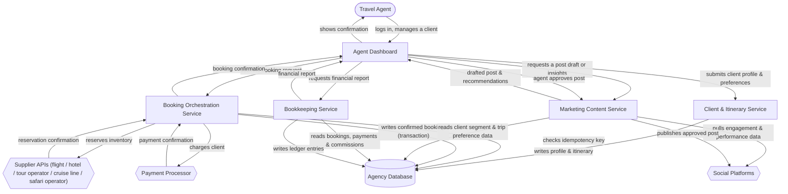

# Architecture: Boutique Travel Concierge

## Project idea
A boutique travel agency for niche/luxury clientele (adventure, honeymoon, luxury travelers), featuring safaris and cruises alongside flights, hotels, and tours. Human travel agents design and book curated trips on behalf of clients, and also handle marketing — drafting social media posts and using marketing insights and recommendations to grow the client base. Software exists to support and coordinate the human agents: client intake, preference/profile capture, itinerary building, supplier (flight/hotel/tour operator/cruise line/safari operator) coordination, payment/booking processing, marketing content support, and bookkeeping — not to replace agents with self-serve search or fully autonomous marketing. The one thing it must do well on day one: reliable booking — booking a flight, hotel, or package with a supplier must work correctly every single time, with no double-booking and no payment errors.

## Components
- **Agent Dashboard** — the web application travel agents use to manage clients, build itineraries, submit bookings, draft marketing posts, and view financial reports; the idea names "human travel agents" as the users of every function, so this stays one internal-facing tool rather than separate apps.
- **Client & Itinerary Service** — the backend that owns client profiles, travel preferences, and the itineraries agents build for them, across all trip types including safaris and cruises; required because the idea calls out "client intake, preference/profile capture, itinerary building."
- **Booking Orchestration Service** — the backend component that exists specifically to guarantee the day-one requirement: it coordinates each booking as a single reliable transaction — checking whether it has already run, reserving with the supplier, charging the client, and only then recording the booking as confirmed — so nothing is double-booked or double-charged even if a step is retried.
- **Marketing Content Service** — an AI-assisted backend that drafts social media post copy and surfaces marketing insights and recommendations (e.g., which trip types or client segments are performing well) for an agent to review, edit, and approve before anything is published; required because the idea says agents "do marketing with social media posts, marketing insights, recommendations." This is the idea's AI/generation layer — it drafts and suggests, it does not publish unsupervised.
- **Bookkeeping Service** — the backend that turns confirmed bookings, payments, and supplier commissions into financial records — invoices, revenue, expenses — and produces the reports agents view; required because the idea explicitly asks for "book keeping."
- **Agency Database** — a relational database (a database that enforces strict record-level rules like uniqueness) storing client profiles, itineraries, bookings, and the financial ledger entries the Bookkeeping Service produces; relational is the right fit because bookings and financial records both need strict uniqueness and transactional guarantees.
- **Supplier APIs** — the external flight, hotel, tour-operator, cruise-line, and safari-operator booking systems the agency reserves inventory through; the idea explicitly names these supplier types.
- **Payment Processor** — the external payment gateway that charges the client for a confirmed booking; required because the idea explicitly calls for "payment/booking processing."
- **Social Platforms** — the external social media platforms (e.g., Instagram, Facebook) where approved posts are published and where engagement data is pulled back from to feed marketing insights.

Safaris and cruises are handled as additional trip and supplier types within the existing Client & Itinerary Service and Supplier APIs — the idea doesn't describe anything structurally different about them (no separate booking flow or data shape), so they don't warrant their own component; adding one would pad the diagram without adding real function.

## Architecture diagram

## Data flow walkthrough
1. The travel agent logs into the Agent Dashboard and opens or creates a client record.
2. The Agent Dashboard sends the client's profile and travel preferences to the Client & Itinerary Service, which writes them to the Agency Database and lets the agent assemble an itinerary — flight, hotel, tour, safari, or cruise — against them.
3. When the agent locks in a booking, the Agent Dashboard sends the request to the Booking Orchestration Service, which checks the Agency Database for a duplicate (idempotency key), reserves the inventory with the relevant Supplier API, charges the client through the Payment Processor, and only then writes the confirmed booking to the Agency Database as one transaction — this is what guarantees no double-booking and no payment errors. The confirmation flows back to the agent.
4. Separately, when the agent wants to market a trip type or promotion, the Agent Dashboard asks the Marketing Content Service for a draft post and current insights; the service pulls client/trip data from the Agency Database and engagement data from Social Platforms, returns a draft plus recommendations, and only publishes to Social Platforms once the agent has reviewed and approved it.
5. For bookkeeping, the agent requests a financial report from the Agent Dashboard, which the Bookkeeping Service builds by reading confirmed bookings, payments, and commissions from the Agency Database, recording the corresponding ledger entries, and returning the report to the agent.
